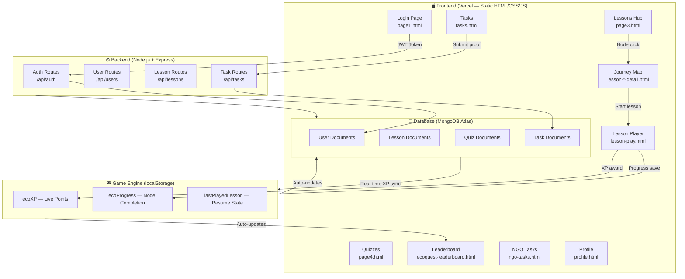
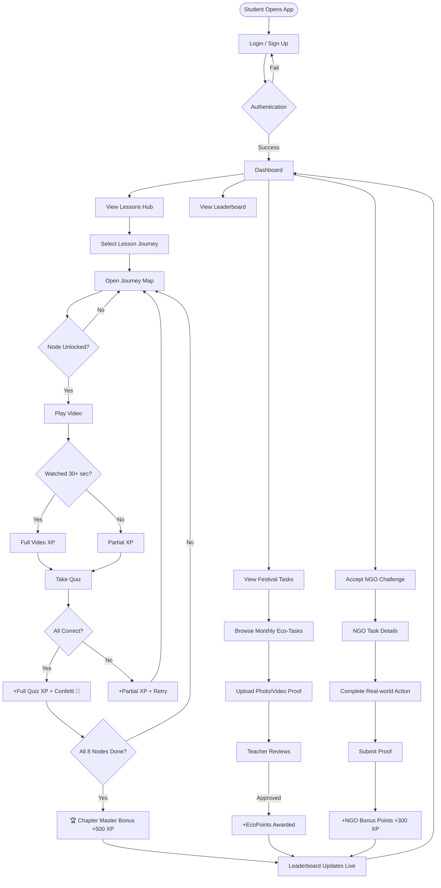

# 🌿 EcoQuest — India's Gamified Eco-Learning Platform

> **🎥 Video Pitch:** _[Click Here to Watch Demo Video](https://docs.google.com/videos/d/1-IZxaGxpePJSpsio2SNv_DQ8mmWdoxpfYVnujYPjJa8/edit?usp=sharing)_
> **📊 Presentation:** _[Add your presentation/slides link here]_
> **🌐 Live Deployment:** [eco-quest-gold.vercel.app](https://eco-quest-gold.vercel.app)
> **📂 GitHub Repository:** [github.com/aryaachalkar/EcoQuest](https://github.com/aryaachalkar/EcoQuest)

---

## 🏆 Hackathon README Checklist

| Requirement | Status |
|---|---|
| ✅ Video Pitch & Presentation links | At top of this file |
| ✅ Live Deployment link | eco-quest-gold.vercel.app |
| ✅ Setup instructions | See [Getting Started](#-getting-started) |
| ✅ Full dependency list | See [Tech Stack & Dependencies](#-tech-stack--dependencies) |
| ✅ Clear description of the hack | See [What We Built](#-what-we-built) |
| ✅ Architecture & workflow diagrams | See [System Architecture](#-system-architecture) |

---

## 🌍 Problem Statement

> Despite the rising urgency of climate change and environmental degradation, **environmental education remains largely theoretical** in many Indian schools and colleges. Students are taught textbook content with little emphasis on real-world application, local ecological issues, or personal responsibility.

There is a critical lack of engaging, interactive tools that:
- Motivate students to adopt **eco-friendly practices**
- Help them understand the **direct consequences** of lifestyle choices
- Inspire **youth participation** in local environmental efforts
- Connect classroom learning with **community action**

### 📉 The Impact
As future decision-makers, students must be **environmentally literate and empowered**. Without innovative education methods, we risk raising a generation unaware of sustainability challenges — undermining India's SDG commitments and NEP 2020's emphasis on experiential learning.

### 🇮🇳 The India-Specific Gap
Indian students are predominantly **academics-focused**, which puts them at a disadvantage during **global university admissions** where holistic profiles (community service, environmental activism, social impact) are heavily weighted. EcoQuest bridges this gap — students earn **verifiable eco-credentials** that document real-world environmental action from **Class 6 onwards**, building a rich social portfolio alongside academic achievement.

---

## ✨ What We Built

**EcoQuest** is a full-stack gamified environmental learning platform targeted at Indian school students (Classes 6–10). It transforms passive textbook knowledge into **active, measurable environmental action** through:

| Feature | Description |
|---|---|
| 🗺️ **Journey Maps** | Duolingo-style winding node maps for each lesson topic (Forests, Wastewater, Soil) |
| 🎮 **Gamified Lessons** | 24 interactive nodes (8 per lesson) with embedded educational videos + adaptive quizzes |
| 🏅 **Eco Points (XP) System** | Performance-based XP — rewards video engagement, quiz accuracy, and real-world tasks |
| 📋 **Festival Tasks** | Monthly eco-tasks tied to Indian festivals (Gudi Padwa, Holi, Diwali) with proof upload |
| 🏆 **Live Leaderboard** | Real-time school-wide rankings updated instantly on quiz/task completion |
| 🤝 **NGO Integration** | Students can accept verified environmental challenges posted by NGO partners |
| 📸 **Proof Upload System** | Students submit photo/video proof of eco-actions reviewed by teachers |
| 🎊 **Celebration Animations** | Confetti, trophy modals, chapter mastery screens (Duolingo-style) |
| 📱 **Mobile Responsive** | Full PWA-ready mobile experience with slide-in sidebar navigation |
| 🔒 **Auth System** | Role-based login (Student / Teacher / NGO Partner) with JWT auth |

---

## 🔗 NGO & Government Integration

EcoQuest is designed as an **open platform** for environmental stakeholders:

### For NGOs
- NGO partners **post verified eco-challenges** (ex: river clean-up drives, tree planting) directly in the app
- Students earn **NGO Bonus Points (+200–350 XP)** for completing verified real-world tasks
- NGOs get **youth volunteer pipeline** — app shows number of students who accepted each challenge
- NGO verification badge system builds trust and gamifies civic participation

### For Government Departments
- **Ministry of Environment / Forest Dept** can post seasonal campaigns (e.g., Van Mahotsav, World Environment Day)
- **Municipal bodies** can issue local clean-up challenges mapped to student neighborhoods
- The platform can serve as a **digital reporting dashboard** for student eco-activity — supporting Smart Cities and Swachh Bharat data collection
- Teachers can submit **class-level impact reports** (kg of waste collected, trees planted) matching government KPIs

### For Schools
- Teachers monitor **class-wide progress** and task completion
- School-level leaderboards drive **healthy peer competition**
- Activity logs generate **verifiable eco-certificates** for college applications (UCAS, Common App, CUET)

---

## 🏗️ System Architecture



---

## 🌀 User Flow Diagram



---

## 🎓 Student Holistic Development Impact

```
Traditional Indian Student Path          EcoQuest Student Path
─────────────────────────────            ──────────────────────────────
📚 Focus: Academics only                 📚 Academics + 🌿 Eco Action
📄 Resume: Marks sheet                   📄 Resume: Marks + Eco Portfolio
🎯 Goal: Score 95%+                      🎯 Goals: Score + Community Impact
🌍 Foreign Uni: Weak profile             🌍 Foreign Uni: Strong holistic profile
❌ No community service record           ✅ Verified NGO hours + eco-certificates
❌ No environmental awareness proof      ✅ XP logs, task completions, badges
```

**By Class 10, an EcoQuest student has:**
- 📊 Verified eco-activity logs (digital evidence for college apps)
- 🤝 NGO collaboration experience (community service hours)
- 🌱 Real-world environmental actions (tree planting, waste segregation)
- 🏅 Achievement badges (UCAS/Common App Personal Statement material)
- 🧠 Environmental science literacy beyond textbooks

---

## 🛠️ Tech Stack & Dependencies

### Frontend (Deployed on Vercel)
| Technology | Version | Purpose |
|---|---|---|
| HTML5 | — | Page structure & semantic markup |
| CSS3 | — | Styling, animations, glassmorphism |
| Vanilla JavaScript | ES2020+ | App logic, DOM manipulation, game engine |
| Google Fonts (Inter, Playfair Display, DM Sans) | — | Typography |
| YouTube Nocookie API | — | Embedded educational videos |
| localStorage API | — | Client-side XP & progress persistence |

### Backend (Node.js + Express)
| Package | Version | Purpose |
|---|---|---|
| `express` | ^4.21.0 | HTTP server & REST API routing |
| `mongoose` | ^8.7.0 | MongoDB ODM for data modeling |
| `jsonwebtoken` | ^9.0.2 | JWT authentication tokens |
| `bcryptjs` | ^2.4.3 | Password hashing |
| `express-validator` | ^7.2.0 | Input validation & sanitization |
| `multer` | ^1.4.5-lts.1 | File upload handling (proof images) |
| `cors` | ^2.8.5 | Cross-Origin Resource Sharing |
| `dotenv` | ^16.4.5 | Environment variable management |
| `nodemon` | ^3.1.7 | Dev auto-restart |

### Database
| Service | Purpose |
|---|---|
| **MongoDB Atlas** | Cloud-hosted NoSQL database |
| Collections: `users`, `lessons`, `quizzes`, `tasks` | Structured data storage |

---

## 🚀 Getting Started

### Prerequisites
- Node.js v18+
- npm v9+
- MongoDB Atlas account (or local MongoDB)
- Python 3 (for local frontend dev server)

### 1. Clone the Repository
```bash
git clone https://github.com/aryaachalkar/EcoQuest.git
cd EcoQuest
```

### 2. Run the Frontend (Static - No Build Needed)
```bash
cd frontend
python -m http.server 8000
# Open: http://localhost:8000/page1.html
```

### 3. Set Up the Backend
```bash
cd backend
npm install
```

Create a `.env` file in `/backend`:
```env
PORT=5000
MONGO_URI=mongodb+srv://<username>:<password>@cluster.mongodb.net/ecoquest
JWT_SECRET=your_super_secret_key_here
```

### 4. Seed the Database
```bash
npm run seed
```
This creates demo students, lessons, quizzes, and tasks.

### 5. Start the Backend Server
```bash
npm run dev       # Development (with hot reload)
# or
npm start         # Production
```

### 6. Open the App
```
Frontend: http://localhost:8000/page1.html
Backend API: http://localhost:5000/api
```

### 🔑 Demo Login Credentials
| Email / Roll | Password | Role |
|---|---|---|
| `ROLL2025001` | `password123` | Student |
| `aarav@school.edu` | `password123` | Student |
| `priya@school.edu` | `password123` | Student |

> **On Vercel (no backend):** Use the **"Continue with Google"** button for instant demo access, or sign up with any details.

---

## 📁 Project Structure

```
EcoQuest/
├── frontend/               # Static HTML/CSS/JS (deployed on Vercel)
│   ├── page1.html          # Login / Sign Up
│   ├── page2.html          # Dashboard
│   ├── page3.html          # Lessons Hub
│   ├── page4.html          # Quizzes
│   ├── tasks.html          # Festival Tasks
│   ├── tasks-upload.html   # Proof Upload
│   ├── ecoquest-leaderboard.html
│   ├── ngo-tasks.html      # NGO Challenges Hub
│   ├── ngo-detail-*.html   # NGO Detail Pages
│   ├── lesson-*-detail.html # Journey Maps (Forests/Water/Soil)
│   ├── lesson-play.html    # Video + Quiz Engine
│   ├── profile.html        # Student Profile
│   ├── water.html          # Water Education Module
│   └── api.js              # Frontend API utility
│
├── backend/                # Node.js + Express REST API
│   ├── server.js           # Entry point
│   ├── routes/             # API route handlers
│   ├── models/             # Mongoose schemas
│   │   ├── User.js
│   │   ├── Lesson.js
│   │   ├── Quiz.js
│   │   └── Task.js
│   ├── middleware/         # JWT auth middleware
│   ├── seed.js             # Database seeder
│   └── .env                # Environment variables (not committed)
│
└── README.md
```

---

## 🌐 API Endpoints

| Method | Endpoint | Description |
|---|---|---|
| `POST` | `/api/auth/register` | Create new student/teacher account |
| `POST` | `/api/auth/login` | Login and receive JWT |
| `GET` | `/api/users/me` | Get current user profile + stats |
| `GET` | `/api/users/leaderboard` | Get school-wide rankings |
| `GET` | `/api/lessons` | Get all lessons |
| `GET` | `/api/lessons/:id` | Get lesson + nodes + quizzes |
| `POST` | `/api/tasks/submit` | Submit eco-task proof |
| `GET` | `/api/tasks` | Get all festival tasks |

---

## 🎯 Key Innovation Highlights

1. **Festival-driven Learning** — Tasks are tied to Indian cultural moments (Gudi Padwa, Holi), making environmental education **culturally relevant**
2. **Duolingo-style Journey Maps** — Visual node-based progress with locked/unlocked states drives **daily engagement**
3. **Three-way Ecosystem** — Students, Teachers, and NGOs all interact in one platform — creating a **verified impact loop**
4. **Performance-based XP** — XP scales with effort: watched video? Correct quiz? Both? — incentivizing **genuine learning**, not gaming
5. **Real-world to Digital Bridge** — Photo proof uploads connect **physical actions** (planting trees) to **digital credentials**
6. **Social Portfolio Builder** — From Class 6, students accumulate a **verifiable environmental portfolio** usable for global university applications

---

## 🤝 Team

| Name | Role |
|---|---|
| Arya Achalkar | Full Stack Developer / Designer |
| Aniket Ingale | Full Stack Developer |

---

## 📄 License

MIT License — Free to use, modify, and distribute with attribution.

---

> *"The greatest threat to our planet is the belief that someone else will save it."* — Robert Swan
>
> **EcoQuest turns that belief into action — one node at a time. 🌱**
